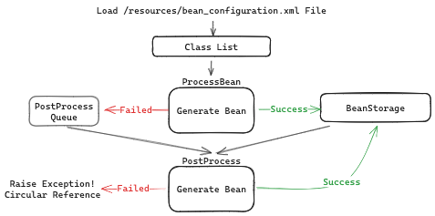
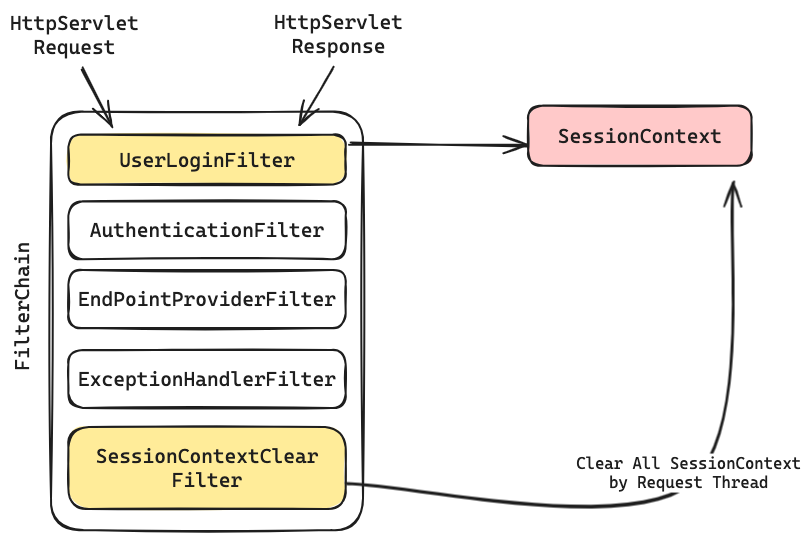
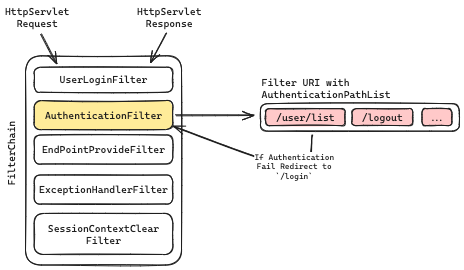
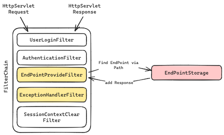

# Java WAS

2024 우아한 테크캠프 프로젝트 WAS

## 🖥️ 배포 주소

- [AWS EC2 - 제 IP만 접속이 가능합니다](http://13.124.168.217:8080/)

## 📚 구현 설명

### ⚙️ 프로젝트 동작 방식


- `Main` 클래스에서 원하는 포트를 갖는 `ServerSocket`을 생성합니다.
- `ServerSocket`은 생성 직후 `BeanFactory`를 통해 Bean을 생성 및 저장합니다.
- 이후 H2 TCP 서버를 개별 스레드로 실행시킵니다.
- `ServerSocket`이 생성되면서 작성된 모든 `EndPointRegister`들을 핸들링해 `EndPoint`를 생성 및 저장합니다.
    - 예시 이미지에서는 `8080` 포트를 사용합니다.
- HTTP 요청이 들어오면 `ServerSocket`은 요청에 대한 `ConnectionRunner`를 스레드로 실행합니다.
    - `ConnectionHandler`는 `HttpRequestParser`로 `HttpServletRequest` 객체를 생성합니다.
    - `ConnectionHandler`는 응답을 담기 위한 `HttpServletResponse` 객체를 생성한 후 `HttpServletRequest`
      객체와 `HttpServletResponse`객체를 `FilterChain`에 전달합니다.
    - `FilterChain`을 통과하며 `HttpServletResponse` 객체에 응답을 담습니다.
        - `FilterChain`의 필터 중 `EndPointProvidFilter`는 `HttpServletRequest` 객체의 Path를 통해 `EndPoint`
          를 찾아 결과값을 `HttpServletResponse` 객체에 응답을 담습니다.
- `ConnectionRunner`는 완성된 `HttpServletResponse` 객체에 `OutputStream`을 위임해 응답을 전송합니다.

## 💡 구현 포인트 살펴보기

### 🔍 `BeanFactory`



- `BeanFactory`는 `Bean`을 생성하고 `BeanStorage`에 저장하는 역할을 합니다.
- `BeanFactory`는 `Bean`을 생성하기 위해 `/resourse/bean_configuration.xml`을 참조합니다.
    - `bean_configuration.xml`은 `Bean`의 클래스 경로를 가지고 있습니다.
    - `Bean`의 클래스 경로를 와 리플랙션을 활용해 `Bean`을 생성 및 저장합니다.
    - 다른 `Bean`을 참조해 생성되는 `Bean`은(Autowire) Post Processing을 통해 참조된 `Bean`을 주입합니다.
- 순환 참조 발생시 `Bean` 생성을 실패하도록 구현했습니다.

### 🔍 `Filter`, `FilterChain`

- `Filter` 인터페이스는 `HttpServletRequest` 객체와 `HttpServletResponse` 객체를 인자로 받아 동작합니다.
- `FilterChain`은 `Filter` 인터페이스를 구현한 객체를 저장하고 순차적으로 실행합니다.

#### `UserLoginFilter`, `SessionContextClearFilter`



- `UserLoginFilter`는 `HttpServletRequest` 객체의 `Cookie`를 통해 로그인 여부를 확인합니다.
    - 로그인이 되어 있다면 SessionContext에 로그인 정보를 저장합니다.
- `SessionContextClearFilter`는 모든 요청을 처리한 이후 `ThreadLocal`에 저장된 `SessionContext`를 초기화합니다.

#### `AuthenticationFilter`



- `AuthenticationFilter`는 HTTP 요청 URI Path가 리스트에 포함되어 있는지 확인합니다.
    - 포함되어 있다면 로그인이 필요한 요청이므로 `Context`에 저장된 로그인 정보를 확인합니다.
    - 로그인이 되어 있지 않다면 `HttpServletResponse` 객체에 `/login`으로 리다이렉트 요청을 담습니다.

#### `EndPointProviderFilter`, `ExceptionHandlerFilter`



- `EndPointProviderFilter`는 `EndPoint`를 찾아 `HttpServletResponse` 객체에 응답을 담습니다.
- `ExceptionHandlerFilter`는 예외가 발생했을 때 `HttpServletResponse` 객체에 예외에 따른 응답을 담습니다.

### 🔍 `EndPoint`

```java

import java.util.function.BiConsumer;

public class EndPoint {

    private final String path;
    private final BiConsumer<HttpServletRequest, HttpServletResponse> biConsumer;
}

```

- `EndPoint` 객체는 응답 Path, 요청에 대한 동작인 `BiConsumer` 함수형 인터페이스를 가지고 있습니다.
- `BiConsumer` 인터페이스는 `HttpServletRequest` 객체와 `HttpServletResponse` 객체를 인자로 받아 동작합니다.
    - `HttpServletRequest`에 담긴 정보를 통해 `HttpServletResponse`에 동적으로 응답을 담습니다.
