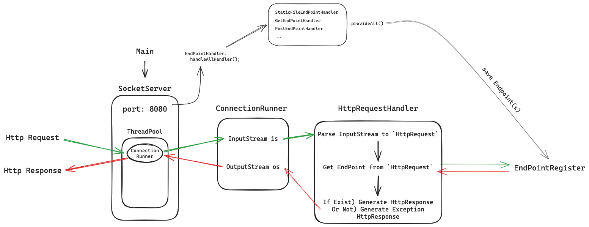

# Java WAS

2024 우아한 테크캠프 프로젝트 WAS

## 🖥️ 배포 주소

- [AWS EC2 - 제 IP만 접속이 가능합니다](http://13.124.250.27:8080/)

## 📚 구현 설명

### ⚙️ 프로젝트 동작 방식



- `Main` 클래스에서 원하는 포트를 갖는 `ServerSocket`을 생성합니다.
- `ServerSocket`이 생성되면서 구현된 모든 `EndPointHandler`를 핸들링해 `EndPoint`를 생성 및 저장합니다.
    - 예시 이미지에서는 `8080` 포트를 사용합니다.
- HTTP 요청이 들어오면 `ServerSocket`은 요청에 대한 `ConnectionRunner`를 스레드로 실행합니다.
    - `ConnectionRunner`는 HTTP 요청 `InputStream`을 `HttpRequestHandler`에 위임합니다.
    - `HttpRequestHandler`는 `InputStream`을 파싱해 `HttpRequest` 객체를 생성합니다.
    - 파싱한 `HttpRequest` 객체를 기반으로 `EndPoint`를 찾아 `HttpResponse`를 생성 및 `ConnectionRunner`에게 반환합니다.
- `ConnectionRunner`는 `HttpResponse`를 `OutputStream`에 쓰고, `Socket`을 닫습니다.

### 🔍 `EndPoint` 살펴보기

```java

public class EndPoint {

    private final String path;
    private final BiFunction<Map<String, String>, T, HttpResponse> biFunction;
}

```

- `EndPoint` 객체는 응답 Path, 요청에 대한 동작인 `BiFunction` 함수형 인터페이스를 가지고 있습니다.
- `Function` 인터페이스는 `Map<String, String>` 타입의 Header 값들과, `String` 타입의 쿼리(GET) or Body(POST)를
  받아 `HttpResponse` 타입의 응답을 반환합니다.
- 예를 들어 `/api/v1/hello` 라는 GET 요청에 Json 형식으로 안녕하세요라는 데이터를 반환한다면, 아래와 같이 `EndPoint`를 생성할 수 있습니다.

```java
EndPoint endPoint = new EndPoint("/api/v1/hello", (header, body) -> HttpResponse.from(
    HttpStatus.OK, "{\"message\": \"안녕하세요\"}".getBytes()));
```

